## chevereto图床数据库转LskyPro

首先我们需要在lsky文件里面新建`images`目录

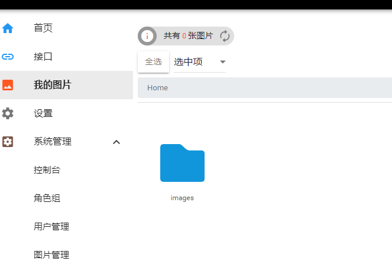

下载项目，然后打包这个两个文件

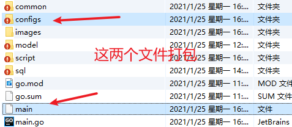

打包后，自己上传到服务器上面，然后我们 `chmod +x main` 让文件具有执行权限

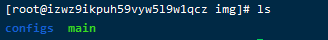

# 迁移数据库

然后到`configs/app.ini` 中进行配置

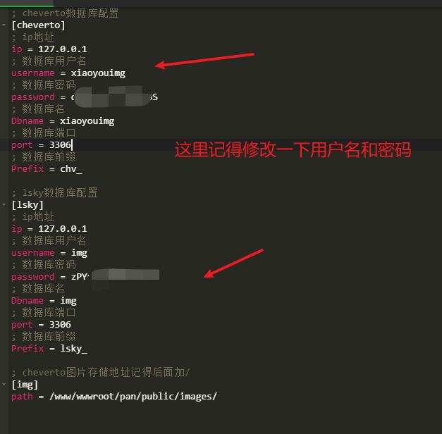

然后我们启动

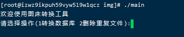

选择操作，我们先转换数据库

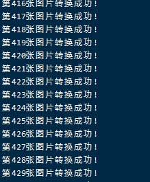

下面我们需要迁移一下网站的数据

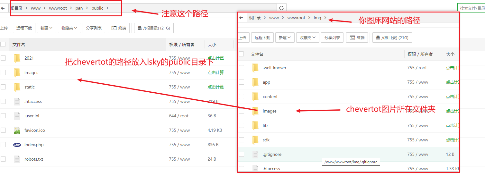

最后我们打开网站就可以看到数据了

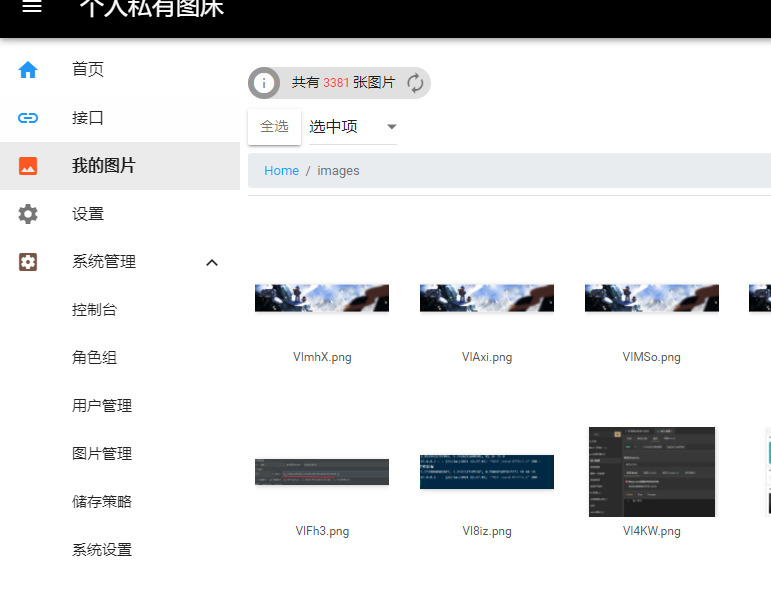

# 删除重复文件

默认图床一个图片会默认分成三种，这里我们用不到

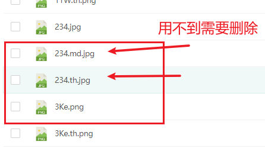

我们这里注意配置一下路径

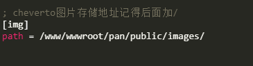

这个是我们lsky图床的图片存储路径

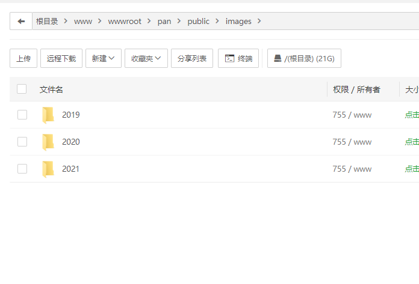

然后我们直接启动应用，选择删除重复文件

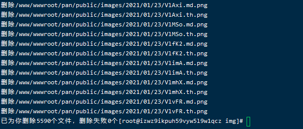

最后就全部迁移完毕了！